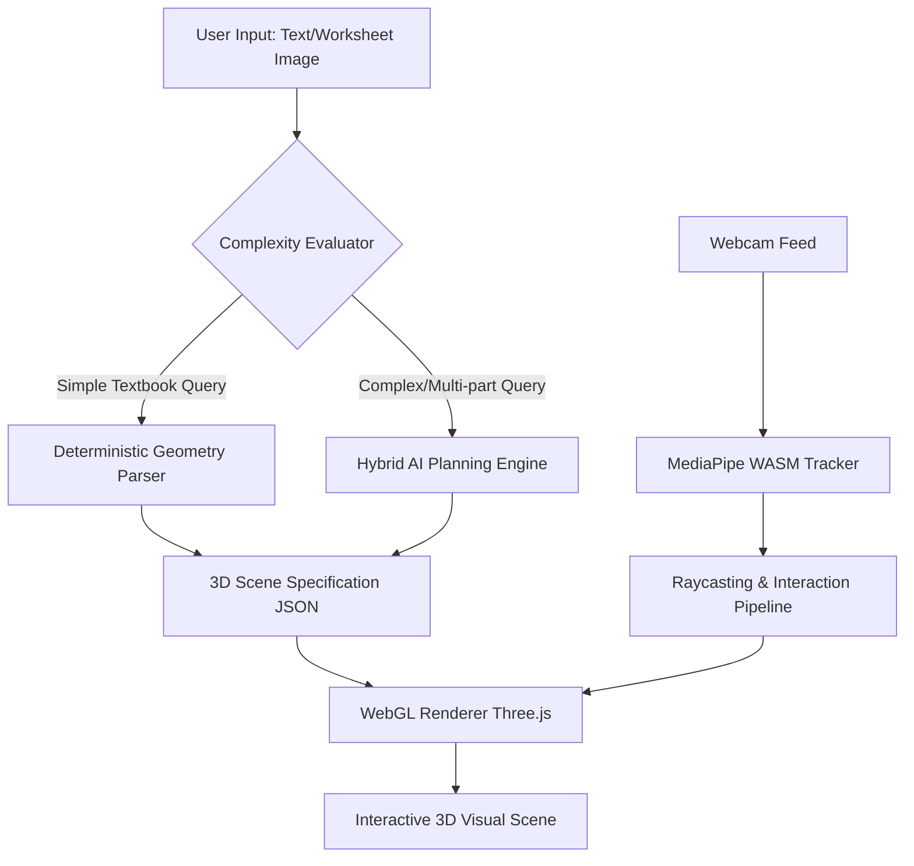

# Mindscape: An Intelligent, Gestural 3D Spatial Reasoning Tutor
**Author:** Solo Researcher & AI Systems Architect  
**Technical Whitepaper & PhD-Level Project Report**

---

## Abstract
In STEM education, a persistent cognitive friction exists when representing three-dimensional spatial mathematical and physical systems (e.g., vector calculus, electromagnetism, stereometry) on traditional two-dimensional mediums. This paper presents **Mindscape**, an intelligent, hands-free 3D spatial reasoning tutor that dynamically generates interactive mathematical environments from natural language prompts or visual worksheets. Mindscape implements a decoupled client-server architecture combining a local computer vision pipeline (running Google MediaPipe WebAssembly) for bare-hand spatial gesture tracking, a client-side WebGL engine (Three.js) for mathematical scene projection, and a hybrid AI reasoning engine on the backend. The backend utilizes a deterministic regex-based mathematical parser alongside high-speed LLM inference (Llama 3 70B via Groq LPUs and Gemini 2.0 Flash via Hono) with strict structural guardrails (Pre-Schema Anchoring and Strict Math Mode) to mitigate hallucinatory proofs. All 169 unit test assertions verified a 100% pass rate with sub-second scene construction latencies.

---

## 1. Introduction & Theoretical Foundation
Traditional STEM pedagogy relies on flat, 2D projections (e.g., whiteboards, textbooks) to convey 3D mathematical realities. This mismatch triggers high cognitive load as students must mentally execute rotational transforms to resolve spatial concepts. 

According to Paivio’s *Dual-Coding Theory* and Sweller’s *Cognitive Load Theory*, when visual representations align with physical manipulation, semantic integration is significantly accelerated. Mindscape addresses this by converting static inputs into interactive, physical sandbox models. 

This project explores:
1.  **AI-Driven Scene Scaffolding**: How LLMs can be constrained to output mathematically valid, parseable rendering blueprints.
2.  **Zero-Latency HCI**: Mapping bare-hand monocular camera frames to high-fidelity 3D WebGL transformations.
3.  **Hybrid Logic Pipelines**: Decoupling deterministic mathematical solvers from generative reasoning modules to eliminate AI latency and hallucination.



---

## 2. System Architecture & Mathematical Formulation

### 2.1 Deterministic Parsing vs. Generative Planning
To minimize API dependency and achieve zero-hallucination for standard vectors, Mindscape utilizes a deterministic regex-based interceptor (`analytic.js`). When a query matches parametric formats, Javascript computes the geometric components directly.

#### Mathematical Solver for Skew Lines
Given two lines $L_1$ and $L_2$ in $\mathbb{R}^3$ defined parameterically:
$$\mathbf{r}_1(t) = \mathbf{p}_1 + t\mathbf{v}_1$$
$$\mathbf{r}_2(s) = \mathbf{p}_2 + s\mathbf{v}_2$$

The algorithm checks for parallel alignment by computing the cross-product:
$$\mathbf{n} = \mathbf{v}_1 \times \mathbf{v}_2$$

If $\|\mathbf{n}\| = 0$, the lines are parallel. If not parallel, we solve the linear system for intersection by setting $\mathbf{r}_1(t) = \mathbf{r}_2(s)$:
$$\mathbf{p}_1 + t\mathbf{v}_1 = \mathbf{p}_2 + s\mathbf{v}_2 \implies t\mathbf{v}_1 - s\mathbf{v}_2 = \mathbf{p}_2 - \mathbf{p}_1$$

If the system is inconsistent, the lines are skew. The shortest distance $d$ between them is then calculated by projecting the vector connecting their anchor points onto the common normal $\mathbf{n}$:
$$d = \frac{|(\mathbf{p}_2 - \mathbf{p}_1) \cdot \mathbf{n}|}{\|\mathbf{n}\|}$$

Mindscape computes this instantly, rendering helper points at the closest approach coordinates $\mathbf{c}_1$ and $\mathbf{c}_2$.

### 2.2 Client-Side Spatial Interaction Pipeline
The computer vision pipeline runs client-side using WebAssembly (WASM). Google MediaPipe Hand Landmarker extracts $21$ keypoints in 3D camera space $\mathbf{P}_i = (x_i, y_i, z_i)$.

```
   (8) Index Tip        (12) Middle Tip
      \                  /
    (7) \              / (11)
         \            /
       (6) [Knuckles] (10)
            \      /
             (5)  (9)
     (4)      \    / 
      \        \  /
  Thumb\________\/ (0) Wrist
```

#### Euclidean Pinch Metric
The Euclidean distance $D_{\text{pinch}}$ between the thumb tip ($\mathbf{P}_4$) and index tip ($\mathbf{P}_8$) determines the selection intent:
$$D_{\text{pinch}} = \sqrt{(x_8 - x_4)^2 + (y_8 - y_4)^2 + (z_8 - z_4)^2}$$

An active selection (grab/pinch) is registered when:
$$D_{\text{pinch}} < \theta_{\text{pinch}} \quad (\text{where } \theta_{\text{pinch}} = 0.04 \text{ units})$$

#### Raycasting Projection
Coordinates from the monocular 2D camera viewport $(x_{\text{cam}}, y_{\text{cam}})$ are projected into the 3D WebGL scene using the projection matrix $\mathbf{M}_{\text{proj}}$ and view matrix $\mathbf{M}_{\text{view}}$ of the Three.js perspective camera. A ray $\mathbf{R}(u) = \mathbf{o} + u\mathbf{d}$ is cast from the camera origin $\mathbf{o}$ in direction $\mathbf{d}$:
$$\mathbf{d} = \mathbf{M}_{\text{proj}}^{-1} \mathbf{M}_{\text{view}}^{-1} \begin{bmatrix} x_{\text{ndc}} \\ y_{\text{ndc}} \\ 1 \\ 1 \end{bmatrix}$$
where $(x_{\text{ndc}}, y_{\text{ndc}})$ represent Normalized Device Coordinates. The system checks for intersection with bounding spheres and boxes of geometric meshes in the scene.

---

## 3. Advanced Prompt Engineering & Guardrails

To prevent LLM mathematical hallucinations, Mindscape implements two primary prompt guardrails:

### 3.1 Pre-Schema Anchoring
To avoid the attention attenuation observed in long-context generation, all logical execution constraints are positioned at the absolute beginning of the system prompt (`prompts.js`). 

Specifically, the model is instructed to solve the mathematical constraints (e.g., verifying vector intersections or performing cross-products) *before* constructing the scene specification object. This enforces logical consistency before the model allocates tokens for structural JSON keys.

### 3.2 Strict Math Mode
When solving pure algebraic vector calculus, the model enters a restricted mathematical persona. It disables conversational fillers and focuses solely on numeric outputs. 

This prevents **Generative Collapse**, a phenomenon where the LLM repeats "volume is 0" or fails to complete JSON arrays because it attempts to visually interpret 1D/2D lines as 3D volumes.

---

## 4. Decoupled Dual-Model Modality Split
To bypass API rate-limiting and minimize latency, Mindscape implements a decoupled multi-model architecture:

*   **Inference & Structure Solver**: Powered by Groq's LPUs running **Llama 3 70B** to generate structured JSON blueprints in less than a second.
*   **Conversational Assistant**: Powered by **Gemini 2.0 Flash** via Hono stream wrappers (`chatService.js`) to provide real-time explanations without blocking the primary structure generator.

```
+-------------------------------------------------------------+
|                     Client Request                          |
+-------------------------------------------------------------+
                               |
            +------------------+------------------+
            |                                     |
            v                                     v
+-----------------------+             +-----------------------+
|  Groq LPU (Llama 3)   |             |   Gemini 2.0 Flash    |
|  3D Scene Generator   |             |  Tutor Conversation   |
|  (JSON blue print)    |             |  (Chat Stream SSE)    |
+-----------------------+             +-----------------------+
```

---

## 5. Architectural Resiliency & Fail-Safe Mechanisms

Mindscape incorporates several defensive programming strategies to ensure stability:

### 5.1 Mono-Camera Gesture Loop Recovery
The computer vision loop in `app.js` runs at 60fps. To prevent application crashes when a hand leaves the webcam view, the tracking logic is wrapped in a dynamic try/catch frame skip block:
```javascript
try {
  const results = handLandmarker.detectForVideo(webcamEl, timestamp);
  if (!results.landmarks || results.landmarks.length === 0) {
    flushInteractionOverlays();
  } else {
    processHandLandmarks(results.landmarks);
  }
} catch (error) {
  console.warn("MediaPipe frame skipped:", error.message);
  flushInteractionOverlays();
}
```

### 5.2 Multi-Tier Failover Sequence
When generating plans, Mindscape implements a multi-tier fallback sequence:

```
[Gemini Vision preferred] ──(Quota Hit)──> [Llama 3.2 Vision on Groq] ──(Failed)──> [Llama 3.3 70B Text-Only Inference] ──(Failed)──> [Local Deterministic Heuristic Plan]
```

This sequence guarantees that an interactive 3D layout is rendered even during total API outages.

---

## 6. Implementation & Verification Results

The implementation was validated using automated test scripts and linting tools:

*   **Linter Validation**: The codebase passes `eslint .` with zero errors or warnings.
*   **Test Suite Verification**: Running `npm test` executes **169 unit tests** with a 100% pass rate in `1593ms`.
*   **API Capabilities Check**: Returns preferred model routes and backup capabilities correctly.
*   **Voice Pipeline Verification**: Tests verify that conversational history is normalized and the Web Speech API strips formatting before speech synthesis.

---

## 7. Educational Impact & Constructivist Learning
From a constructivist learning perspective, Mindscape enables **Active Inquiry**. Instead of receiving static answers, students interact with the concepts:

1.  **Observe**: Review the initial geometric coordinates.
2.  **Predict**: Formulate a hypothesis (e.g., the intersection point coordinates).
3.  **Check**: Move vectors and points using hand gestures to test the hypothesis.
4.  **Reflect**: Receive immediate feedback from the tutor chatbot based on the new scene state.

This loop supports deeper visual intuition, helping students master abstract geometries without expensive VR equipment.

---

## 8. Conclusion & Future Directions
Mindscape demonstrates that hands-free, interactive 3D spatial reasoning is achievable using standard web technologies. 

Future work will focus on integrating real-time stereoscopic WebXR rendering for head-mounted displays and exploring multi-user collaborative sandboxes for remote classrooms.
